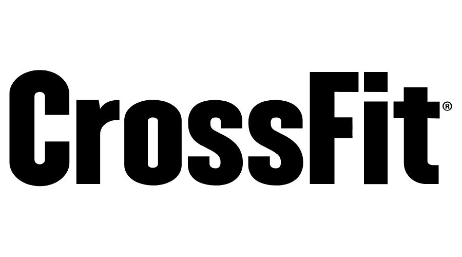
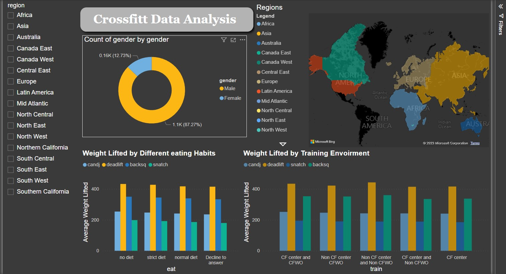

**<h1 style="text-align: center;"> Crossfit Data Analysis Project</h1>**
---

## Table of Contents
- [** Crossfit Data Analysis Project**](#-crossfit-data-analysis-project)
- [Table of Contents](#table-of-contents)
- [Background](#background)
- [Introduction](#introduction)
  - [**Questions to be answered**](#questions-to-be-answered)
  - [**Steps Performed**](#steps-performed)
- [Data Collection](#data-collection)
- [Data Cleaning and Preprocessing](#data-cleaning-and-preprocessing)
- [Exploratory Data Analysis](#exploratory-data-analysis)
- [Interactive Dashboard](#interactive-dashboard)
- [Report](#report)
- [Word Glossary](#word-glossary)
- [Author](#author)
___
########~~~~~~~~~~~~~~~~~~~~~~~~~~~~~~~~~~~~~~~~~~~~~~~~~~~~~~~~~~~~~~#########
## Background
CrossFit is a fitness regimen that has gained popularity in recent years due to its high-intensity workouts that combine weightlifting, gymnastics, and cardio exercises. CrossFit athletes are individuals who engage in this fitness program and participate in CrossFit competitions to showcase their skills and physical prowess. The CrossFit community is a rapidly growing and diverse group of individuals with varying levels of fitness and training backgrounds.

To better understand the characteristics and performance of CrossFit athletes, a comprehensive dataset has been collected from competitions and events around the world. This dataset includes information on athlete demographics, such as age, gender, and training experience, as well as their performance metrics, such as time, weight lifted, and repetitions completed. The dataset covers various CrossFit events and competitions, providing a wealth of information on athlete performance in different contexts and settings.

This dataset is valuable for fitness researchers and practitioners who are interested in understanding the physiological and psychological factors that contribute to successful CrossFit performance. By analyzing the data, researchers can identify trends and patterns that may be associated with higher levels of performance, such as age, gender, training volume, and exercise selection. This information can be used to develop evidence-based training programs for CrossFit athletes that optimize their physical abilities and reduce the risk of injury.

In summary, this dataset provides a unique and valuable resource for the CrossFit community, enabling researchers and practitioners to gain insights into the characteristics and performance of CrossFit athletes and develop evidence-based training programs that support their physical and mental wellbeing.

___
########~~~~~~~~~~~~~~~~~~~~~~~~~~~~~~~~~~~~~~~~~~~~~~~~~~~~~~~~~~~~~~#########
## Introduction
In this project, I have analyzed the CrossFit dataset to gain insights into the characteristics and performance of CrossFit athletes. I have used the dataset to answer the following questions:
### **Questions to be answered**
- How does eating habits affect the performance of an athlete?
- How does training habits affect the performance of an athlete?
- How does athletic background affect the performance of an athlete?
- Does coming from a specific region of the world affect the performance of an athlete?

To Answer these questions, I have performed the following steps:
### **Steps Performed**
1. Data Collection
2. Data cleaning and Preprocessing
3. Exploratory Data analysis
4. Interactive dashboard
5. Report
___
########~~~~~~~~~~~~~~~~~~~~~~~~~~~~~~~~~~~~~~~~~~~~~~~~~~~~~~~~~~~~~~#########
## Data Collection
I have Downloaded this dataset from kaggel. All credits to the person who has uploaded this dataset on kaggel. The dataset can be found [here](https://www.kaggle.com/datasets/ulrikthygepedersen/crossfit-athletes).
___
########~~~~~~~~~~~~~~~~~~~~~~~~~~~~~~~~~~~~~~~~~~~~~~~~~~~~~~~~~~~~~~#########
## Data Cleaning and Preprocessing
The dataset contained almost 80 percent missing values in almost all of the columns. After dropping unwanted columns i had no other choice but to simply drop the null values as they were too many to be imputed. After dropping the null values i had to do feature engineering of the columns which had multiple survey responses, I converted these responses into groups.
____
########~~~~~~~~~~~~~~~~~~~~~~~~~~~~~~~~~~~~~~~~~~~~~~~~~~~~~~~~~~~~~~#########
## Exploratory Data Analysis
I have performed exploratory data analysis on the dataset to answer the questions mentioned above. I have used the following visualizations to answer the questions:
- Bar plots
- Scatter plots
- Pie charts
- Lm plots
___
########~~~~~~~~~~~~~~~~~~~~~~~~~~~~~~~~~~~~~~~~~~~~~~~~~~~~~~~~~~~~~~#########
## Interactive Dashboard
I created an Interactive dashboard report using Power BI. The dashboard can be found [here](https://app.powerbi.com/groups/me/reports/11d1ab98-b5bd-4411-af1c-aea68d0df236/ReportSection)

____
########~~~~~~~~~~~~~~~~~~~~~~~~~~~~~~~~~~~~~~~~~~~~~~~~~~~~~~~~~~~~~~#########
## Report
Keeping in mind an imaginary Fitness company, I assembled a presentation fot the stakeholders of the company. This presentation highlightes the key findings of the analysis and the dashboard which can benefit the company in making decisions.This presentation named Data Analysis.pdf is listed aboce in the repositry, it can be downloaded and viewed.

____
########~~~~~~~~~~~~~~~~~~~~~~~~~~~~~~~~~~~~~~~~~~~~~~~~~~~~~~~~~~~~~~#########
## Word Glossary

| Column Name | Description | Metrics |
|---|---|---|
|region| From which region of the World the athlete belong| |
|gender| Gender of the athlete| |
|age| Age of the athlete| |
|height| height of the athlete| Inches|
|weight| Weight of the athlete| Pounds|
|fran| Fran is a CrossFit benchmark workout that consists only of two exercises — thrusters and pull-ups. You'll perform 90 reps total: 45 thrusters and 45 pull-ups. The rep scheme descends from 21 to 15 to nine| Fran Time|
|helen| Helen begins with a 400-meter run followed by 21 kettlebell swings (50 pounds for men, 35 pounds for women) and 12 pull-ups. Repeat this for a total of three rounds.| Helen time|
|grace| Grace is a CrossFit Girl benchmark workout (WOD). Grace is also one of the best known CrossFit workouts. It is just 30 cleans and jerks for time with 135 lbs for men and 95 lbs for women| Grace time|
|filthy50| Filthy Fifty — a chipper-style WOD — involves chipping away at 10 different movements, 50 reps at a time. For example, you'll start with 50 box jumps. When you finish the 50 box jumps, move on to 50 jumping pull-ups, and so forth|Filthy Fifty Time|
|fgonebad| Fight Gone Bad is 3 rounds of 5 minutes of work with 1 minute of rest between each round. The five minutes of work is made up of one minute at five different stations: wall balls, sumo deadlift high pulls, box jumps, push presses and rowing. The clock does not stop or reset in between exercises.| Fgonebad Time|
|run400| Run400 is a Crossfit workout in which athletes run 400 meters| Run400 Time |
|run5k| Run5k is a Crossfit workout in which athletes run 5000 meters| Run5k time|
|candj| The most common variation of the Clean and Jerk typically has the athlete receiving the load in a full front squat, then using the split position in the jerk.| candj weight|
|snatch| The snatch is basically a move that involves flinging a weight from the ground over the head in one fluid motion.| snatch weight |
|deadlift| The deadlift is one of CrossFit's nine foundational movements and is the safe and sound approach by which any object should be lifted from the ground. It is unrivaled in its simplicity and impact while unique in its capacity for increasing head-to-toe strength.| deadlift weight |
|backsq| The back squat requires the structures of the lower body and core to work synergistically. Optimal performance requires an adequate range of motion at the ankles, hips, and knees; superior lower-body strength; and a tremendous amount of core stability.| backsq weight|
|pullups| Pull-ups in CrossFit – called kipping pull-ups – use a swinging motion that allows you to get into a productive rhythmic movement.| Max set of pullups|
|eat| What is diet routine of aathlete| |
|train| What is the training routine and place of athlete| |
|background| What is the athletic background of the athlete| |
|experience| What is the level of experience the athlete has| |
|schedule| What is the training shedule of the athlete| |
|howlong| For how long has the athlete been training| |
___
########~~~~~~~~~~~~~~~~~~~~~~~~~~~~~~~~~~~~~~~~~~~~~~~~~~~~~~~~~~~~~~#########
## Author
>**Muhammad Umair Salim**
\
Data Science Certifications
>- IBM Data Science Professional Certificate
>- Google Advanced Data Analytics Professional Certificate
>- UoA Faislabad Data Science Professional Certificate
>- UoM Statistics with Python Specialization
\
[Email](umairsalim@datistan.onmicrosoft.com)
\
[Kaggle](https://www.kaggle.com/umairsalim219)
\
[LinkedIn](https://www.linkedin.com/in/muhammad-umair-salim-a0401a256/)
\
[GitHub](https://github.com/Umair-Salim)
\
[Twitter](https://twitter.com/UmairSalim5)
